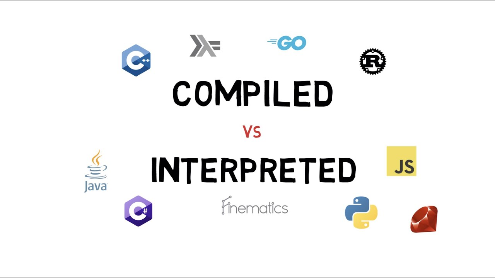
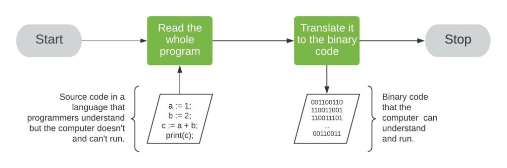
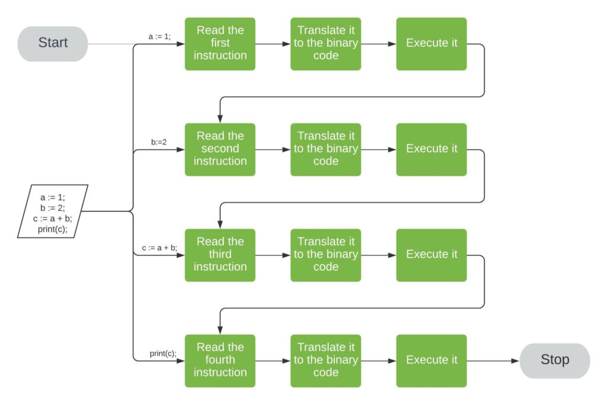

## usages of C++
- video games (Assasin's Creed, Elder Scrolls, Fallout 4, Skyrim, Metro)
- IoT
- VR
- AI

## reasons to learn C++ as first computer language
- C++ is close to the metal
  
  - just a few steps from assembly
- you learn how to manage efficiently the memory and how to deal with pointers(how they work); it's really usefull to know how much memory your program uses and what is it's averige execution time for example;
- you can have better understanding of meta-programming a.k.a reflection (advanced topic for now) - basically how a program can examine information about itself
- generic programming (advanced for now, but will see them in the end of the semester I think)
- compile time vs load time difference:
    - compile time - when your compiler goes through your code and transforms it into executable
    - load time - when your OS is reading the executable from HDD and load it into RAM
- if you learn the base and the consepts on c++ it's easy to learn other languages
- better develops problem solving skills 

## Compiled vs Interpreted languages

- compiled - translate the code to executable binary code. We run the binary code on the computer that we compiled the program, that's because the binary code depends on the hardware and is not portable. Compilers catch erros at compile time.
- interpreted - interpreters read and execute the program at hand instruction by instruction. After being read, each instruction is translated into the machine's binary code and run. **Interpreters don't produce binary executable file.** Interpreters are used during the execution of the program, and for contrast the compilers are needed only during compilation. Interpreters catch erros at runtime.

Example:
```
a := 1;
b := 2;
c := a + b;
print(c);
```

- compiler point of view:

- interpreter point of view:


## C++ version highlights

- C++ 11 (what we will use)
  - smart pointers
  - hash tables
  - std::array
  - move semantics
  - lambda functions
  - auto (forbidden for using in this course)
  - constexpr - performance optimization <-> statements with this keyword are calculated in compile time and the result is used in run time

- C++ 14
  - generalized lambdas
  - Reader-Writer locks
  - constexpr -> enhancement

- C++ 17
  - nested namespaces
  - variable declaration in if and switch
  - if constexpr statements
  - folding expression a.k.a spread operator in JS

- C++ 20
  - std::to_array
  - <=> 3-way comparisons a.k.a spaceship operator
  - range-based for loop with initialization
  - new identifiers(import, module)
  - calendar and time zone library
  - added some std::string functions  