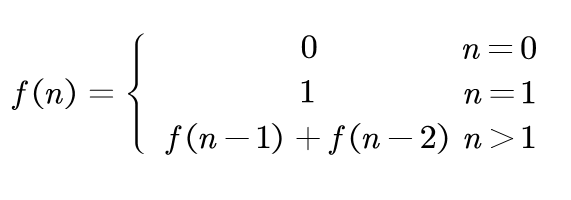
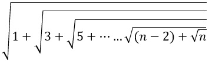
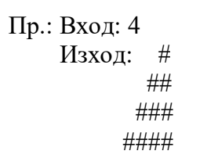
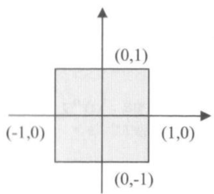
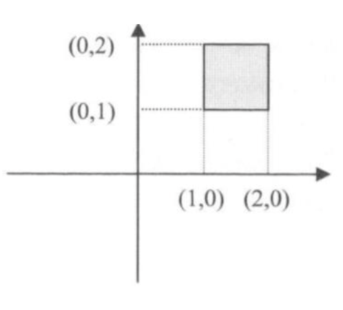
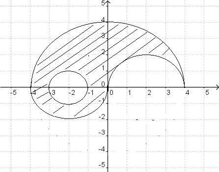

# Задачи

## Цикли
1) Да се напише програма, която въвежда n-цифрено число и проверява дали е палиндром. (Без използване на масиви)

2) Да се напише програма, която въвежда 3 числа и проверява дали те могат да бъдат страни на триъгълник.

3) Да се напише програма, която приема две цели числа и един от символите +, -, *, / и %. Ако символът, е един от тях, да се извърши съответната операция върху двете числа. В противен случай да се хвърли грешка и да се catch-не, като се изведе подходящо съобщение на потребителя.

4) Да се направи програма, която въвежда две числа - n и m - съответно ден и номер на месец от годината и извежда зодията на човека роден в този ден. (да се изплозва switch конструкцията) При грешно въведени числа, да се хвърля грешка и да се изведе подходящо съобщение.

5) Да се напише програма, която по зададено число n >= 0, намира n-тото число от редицата на Фибоначи.

6) Да се напише програма, която при въведено число извежда неговите прости делители.

7) Да се напише програма, която въвежда n от клавиатурата и намира стойността на израза:

8) Да се напише програма, която представя въведено от клавиатурата десетично число в двоична
бройна система.

9) Да се напише програма, която печата всички четирицифрени числа, чиито сбор на първите две
цифри е равен на сбора на вторите две цифри.

10) Да се напише програма, която да определя дали дадено число е “нарцистично”. Число n се
нарича нарцистично, ако изпълнява следното условие: n = (ak)^k + (ak-1)^k + ... + (a2)^k + (a1)^k,
тоест сумата от цифрите на числото, повдигнати на степен броя на цифрите, да е самото число.

11) Числата a и b се наричат сдвоени прости числа, ако са прости и ако a + 4 = b. Напишете
програма, която извежда на екрана всички двойки сдвоени четни числа в даден интервал [p, q] (p и q
се въвеждат от клавиатурата).

12) Да се напише програма, която въвежда число n и печата триъгълник от "#". Броят на символите
на ред да е равен на номера на реда, а максималният по дължина ред да има n символа “#”.

## Още задачи за условни оператори
1) Да се напише програма, която проверява дали въведената от клавиатурата точка с координати x и y принадлежи на защрихованата част от чертежа. След като проверката е направена, да се изведе подходящо съобщение.
- 
- 
- 

## По-сложни задачки

1) Да се напише програма, която за въведено n >= 0 извежда всички съвършени числа в интервала [0, n].

<b>Какво е съвършено число?</b>

>Съвършено число е такова, което се получава като сума на делителите си (без себе си).

<b>Пример</b>

>6 = 1 + 2 + 3

>28 = 1 + 2 + 4 + 7 + 14

>Следващите са 496, 8128,....

2) [Shuffle](./shuffle.pdf)